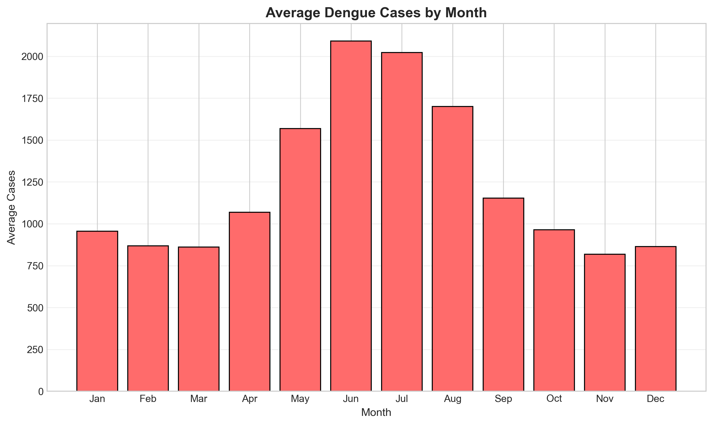
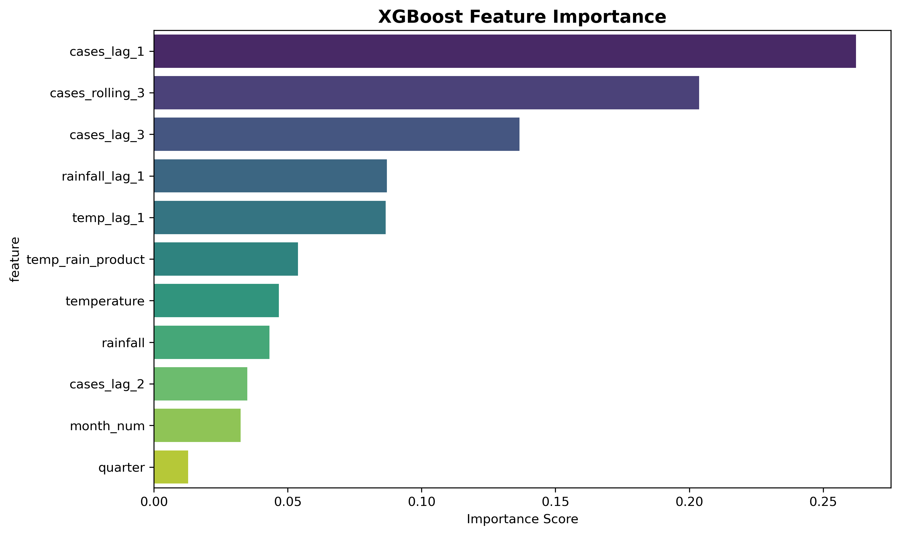
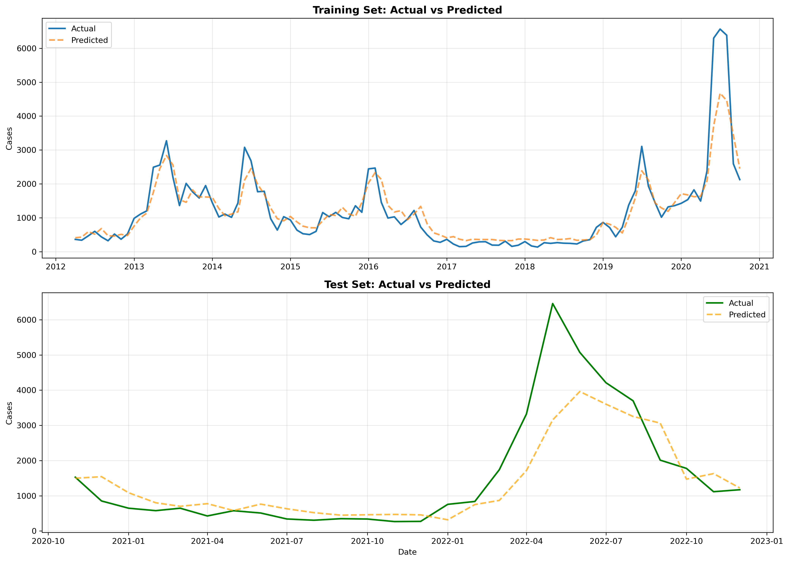
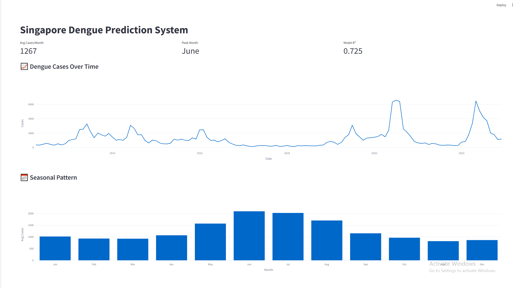
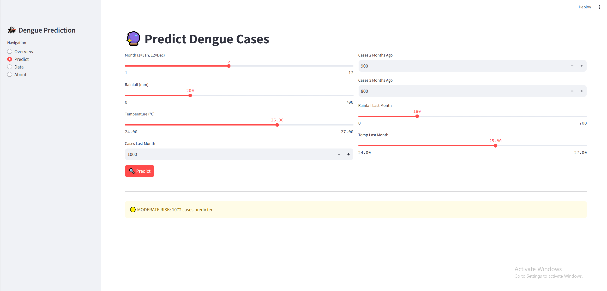
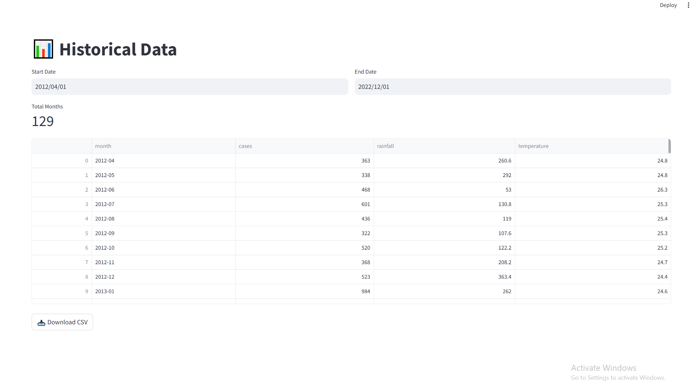

# 🦟 Singapore Dengue Outbreak Prediction System

An AI-powered early warning system that predicts dengue cases in Singapore using weather patterns and machine learning.


---

## 📊 Project Overview

This project develops a machine learning model to predict monthly dengue cases in Singapore based on:
- Historical dengue case data
- Weather patterns (rainfall and temperature)
- Seasonal trends

**Why this matters:** Dengue is a major public health concern in Singapore. Early prediction enables better resource allocation and preventive measures.

---

## 🎯 Key Results

| Metric | Baseline | XGBoost | Improvement |
|--------|----------|---------|-------------|
| Test MAE | 534.88 | 521.10 | 2.6% ✅ |
| Test R² | - | 0.725 | - |
| Training R² | - | 0.851 | No overfitting ✅ |

**Model beats baseline naive forecast while maintaining good generalization.**

---

## 📈 Sample Visualizations

### Seasonal Pattern


### Feature Importance


### Model Predictions


---
## 💻 Application Demo

### Overview Dashboard

*Interactive dashboard showing dengue trends and seasonal patterns*

### Prediction Interface

*Real-time prediction interface with risk level alerts*

### Historical Data Explorer

*Browse and download historical dengue and weather data*
---
## 🔧 Features Engineered

**Lag Features (Historical):**
- `cases_lag_1, cases_lag_2, cases_lag_3` - Cases from 1-3 months ago
- `cases_rolling_3` - 3-month moving average

**Weather Features:**
- `rainfall, temperature` - Current month weather
- `rainfall_lag_1, temp_lag_1` - Previous month weather
- `temp_rain_product` - Interaction term

**Temporal Features:**
- `month_num` - Month of year (1-12)
- `quarter` - Quarter (1-4)

**Total:** 11 engineered features

---

## 🏆 Top 5 Most Important Features

1. **cases_lag_1** (26.2%) - Cases from last month
2. **cases_rolling_3** (20.4%) - 3-month average
3. **cases_lag_3** (13.7%) - Cases from 3 months ago
4. **rainfall_lag_1** (8.7%) - Previous month rainfall
5. **temp_lag_1** (8.7%) - Previous month temperature

**Key Insight:** Historical cases and lagged weather patterns are strongest predictors.

---

## 📁 Project Structure
```
singapore-dengue-prediction/
├── app/
│   ├── dengue_app.py           # Streamlit web application
│   └── requirements.txt         # App dependencies
├── data/
│   ├── raw/                     # Original datasets
│   │   ├── dengue_data.csv
│   │   ├── rainfall_data.csv
│   │   └── temperature_data.csv
│   └── processed/               # Cleaned and merged data
│       ├── dengue_cleaned.csv
│       ├── weather_cleaned.csv
│       ├── dengue_weather_monthly.csv
│       └── dengue_features_final.csv
├── notebooks/
│   ├── 01_data_exploration.ipynb
│   ├── 02_data_preparation.ipynb
│   ├── 03_exploratory_data_analysis.ipynb
│   ├── 04_feature_engineering.ipynb
│   ├── 05_baseline_model.ipynb
│   └── 06_xgboost_model.ipynb
├── models/
│   └── xgboost_model.pkl        # Trained model
├── images/                       # Visualizations
└── README.md
```

---

## 🚀 How to Run

### Prerequisites
- Python 3.8+
- Jupyter Notebook
- Required libraries (see requirements)

### Installation

1. **Clone repository:**
```bash
git clone https://github.com/yourusername/singapore-dengue-prediction.git
cd singapore-dengue-prediction
```

2. **Install dependencies:**
```bash
pip install -r app/requirements.txt
```

3. **Run Streamlit app:**
```bash
cd app
streamlit run dengue_app.py
```

4. **Explore notebooks:**
```bash
jupyter notebook
```

---

## 📊 Data Sources

All data from **data.gov.sg** (Singapore Government Open Data):

1. **Dengue Cases:** Weekly Infectious Disease Bulletin Cases
   - Filtered for "Dengue Fever" and "Dengue Haemorrhagic Fever"
   - Aggregated to monthly frequency

2. **Rainfall:** Rainfall - Monthly Total
   - Monthly total rainfall in millimeters

3. **Temperature:** Surface Air Temperature - Monthly Mean
   - Mean daily minimum temperature

**Period:** 2012-2023 (monthly data)

---

## 🔬 Methodology

### 1. Data Collection & Preparation
- Collected dengue and weather data from data.gov.sg
- Converted weekly dengue data to monthly
- Merged datasets on month
- Handled missing values

### 2. Exploratory Data Analysis
**Key Findings:**
- Strong seasonality: June-July peak (~2,100 cases), Nov lowest (~830 cases)
- Weak direct correlation between current weather and cases
- Time lag effect: previous month's weather matters more
- Major outbreaks in 2020 and 2022 (~6,500 cases/month)

### 3. Feature Engineering
- Created lag features (1-3 months)
- Rolling averages for trend smoothing
- Weather lag features to capture breeding delay
- Seasonal indicators (month, quarter)

### 4. Model Development
**Baseline:** Naive forecast (next month = this month)
- MAE: 534.88

**XGBoost Regressor:**
- Hyperparameters tuned to prevent overfitting
- Regularization applied (L1, L2)
- 80/20 time-series train-test split
- Final MAE: 521.10 (beats baseline)

### 5. Web Application
Interactive Streamlit app with:
- Historical data visualization
- Real-time predictions
- Risk level alerts (Low/Moderate/High)

---

## 💡 Key Insights

1. **Seasonality is dominant:** Month of year is critical for predictions
2. **Outbreak momentum:** High cases persist month-to-month (lag features crucial)
3. **Weather lag effect:** Mosquito breeding delay means previous month weather matters more than current
4. **Modest but valid improvement:** 2.6% over baseline is realistic for seasonal disease prediction

---

## 🛠️ Technologies Used

**Data Processing & Analysis:**
- Python 3.8+
- Pandas, NumPy
- Matplotlib, Seaborn, Plotly

**Machine Learning:**
- XGBoost
- Scikit-learn
- Joblib

**Web Application:**
- Streamlit

**Development:**
- Jupyter Notebook
- Git & GitHub

---

## 📚 Future Improvements

- [ ] Add more weather features (humidity, wind speed)
- [ ] Incorporate population density data
- [ ] Test Prophet for time-series forecasting
- [ ] Deploy model as REST API
- [ ] Add automated retraining pipeline
- [ ] Include mosquito breeding site data
